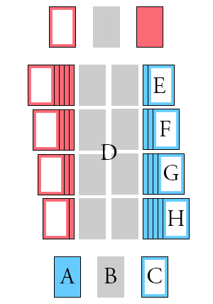

#Schikanöschen
Schikanöschen
([[ˌʃikanˈøzχɛn]](https://en.wikipedia.org/wiki/International_Phonetic_Alphabet))
is a game played by 2 opposing players.

##Goal
The goal of the game is to get rid of all cards on your side, and have all your
cards in the middle turned face-up.

##Setup
The game is played with Patience cards, i.e. two full card decks (52 cards + 3
jokers).  The two decks should be distinguishable by their backs, and are
ideally half-sized bridge or poker cards.

Two players sit on opposite ends of a table, facing each other.

To start, shuffle both decks thouroughly (one shuffled by each player), have
each player cut the deck of their opponent and then take their deck in their
hands.

Both player then deal 13 cards face-down on a stack, this stack is placed on
their side towards the right (the side stack; stack C).

Using the remaining cards, the players then deal four cards seperately,
vertically, in the middle towards the right (stacks E-H). A face-up card is
placed on the top-most stack (stack E), and one face-down card each on the
other three. Now a face-up card is placed on the next stack (stack F) and a
face-down card each on the other two. This process is repeated until each stack
has a face-up card and one to four face-down cards (see illustration). These
stacks are arranged such that all cards are permanently visible, all other
stacks are neatly squared such that only the top card is visible.

Stacks E-H of both sides are considered the board, stacks D are the [→final
stacks](#final-stacks), stacks A-C are considered stacks of the player sitting
in front of them.

The remaining cards become the main stack (stack A), between the main stack and
the side stack, leave a space for another stack, the discard stack (stack B).
The top card on the side stack is then turned around and the player with the
higher card begins. An ace is considered higher than
other normal cards, a joker is higher than an ace.  If the two values are the
same, then clubs is better than spades is better than hearts is better than
diamonds.

If the two cards are identical, the cards on stack E decide, and if those are
identical two, stack F, G, and H, in that order. If all open cards are exactly
the same, start over with shuffling.

The player that starts the game starts as the active player, the other one as
the passive player. At all times, one of the players is active, the other one
passive.

##Actions
When active, a player can perform sequences of the following actions:

- Moving a card from the side stack, discard stack or a stack of the board to a
  stack of the board, a [→final stack](#final-stacks), or the side stack or
  discard stack of the other player.
- Turning over a card from the main stack (if necessary, by turning around the
  discard stack first, without shuffling) and putting it on a stack of the board,
  a final stack, or the discard or side stack of the other player.
- Taking a joker out of the game from a board stack, or their own main, side or
  discard stacks.
- Turning over a face-down card on the (relative) right side of the board, if
  it's the top card.
- Turning over a card from the main stack (if necessary, by turning around the
  discard stack first) and putting it on the discard stack. This makes the
  active player the passive one and the previously passive one the active one.

No other things are actions, only (attempted) actions are knockable.

The active player can never take cards from the private stacks of the passive
player.

##Moving cards
On the board, cards can be put on empty slots, or on a face-down card. A card
can also be placed on a face-up stack card if the following three conditions
apply:

- The card being placed is of a different color (red vs. black) than the stack
  card
- The card has a value one lower than the stack card (e.g. two of diamonds on a
  3 of spades)
- There is either no face-down card in the stack, or the amount of face-up
  cards is no more than four after the card would have been placed down.

Cards can be moved on opponent stacks (side and discard stack) if the stack
card is one lower or one higher than the card that is being placed, and they
have the same suit.

Whenever a player moves the last face-up card from her side stack, the top card
has to be turned face-up. This turning of the top card of the side stack is a
non-action and can be done at any time legally (i.e. the passive player can
never [→knock](#knocking) because of it).

##Final stacks
The stacks in the middle are called "final stacks", because any card that has
been placed there will stay there indefinitely. Whenever an ace can be moved,
it has to be moved to one of the (empty) final stacks. When the next-highest
card is movable (the corresponding two), it has to be moved on the final stack,
and so on. Whenever a card can be moved to a final stack, it has to be done,
and no other actions may be done.

Cards from the board have priority over player stacks, i.e. if there are two
cards that have to be moved to a final stack, one on the board, and one on the
discard or side stack of a player, the one on the board has to be moved
(first).

##Knocking
The passive player can choose to knock on the table in one of three cases:

- an active player would have to move a card to a final stack, but attempts
  another move (by merely touching another card)
- an active player would have to move a card to a final stack, but attempts to
  place it somewhere else (by placing it and ceasing to touch the card)
- an active player tries to place a card from her side or discard stack to a
  final stack, but a card from the board could be moved to a final stack (by
  merely touching her card)

The passive player can knock or choose not to knock. In the first case, the
passive player can also wait until the active player has made the (wrong) move
and then immediately knock. In that case and in the second case, the knocking
player can choose whether or whether not to revert the move.

The right to knock expires after another (legal) action has been done, even if
that action is the correction of the illegitimacy of the previous move.

If the passive player knocks, she immediately becomes the active player and the
previous active player the passive one.

Should the passive player knock even though the active player did nothing
wrong, a single warning is issued against the passive player. Should they knock
incorrectly again, they lose the game.

##End of the Game
The game ends when a player has all board cards on her right side face-up, and
she has no cards in her stacks. That player is the winning player.

It can happen that a game becomes stuck and no more progress is made. A player
can offer the other one a remis, if the other player accepts the game ends in a
draw.

##Edgecases
Since turning around the discard stack and subsequently taking a card from the
main stack is considered a single action, merely turning around the discard
stack is knockable. It usually is anyways because touching the discard stack is
knockable unless the required action is moving a card from the stack to a final
stack.

If the active player has a single card left in their own stacks, and moving it
either to the board in general, or not moving it to a final stack is knockable,
and the passive player knocks, the card is returned to the originating stack.

If there are no cards in the side stack left, no cards can be put on it anymore.

If there are no cards in the main+side stacks anymore, a player signals the end
of their move by knocking on the table. This can't be mistaken for a regular
knock, since they are an active player.
